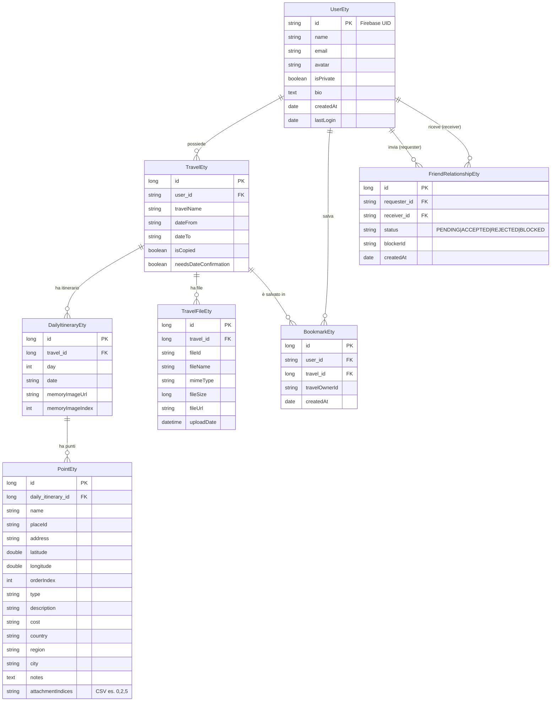

# Voyage — Database Reference

Modello dati dell'applicazione Voyage. Database: **PostgreSQL**, ORM: **Hibernate/JPA**.  
Le collezioni lazy sono caricate con `@BatchSize` per evitare `MultipleBagFetchException` su `List` multiple annidate (Hibernate 6).

---

## Diagramma ER

---

## Entità

### `UserEty` — tabella `users`

Utente dell'applicazione. L'ID corrisponde al **Firebase UID** (stringa immutabile assegnata esternamente — nessun `@GeneratedValue`).

| Campo | Tipo | Vincoli | Note |
|---|---|---|---|
| `id` | `String (255)` | PK | Firebase UID |
| `name` | `String (255)` | NOT NULL | |
| `email` | `String (255)` | NOT NULL, UNIQUE, IX | |
| `avatar` | `String (500)` | | URL avatar |
| `isPrivate` | `boolean` | | default `false` |
| `bio` | `TEXT` | | |
| `createdAt` | `Date` | NOT NULL, updatable=false | valorizzato da `@PrePersist` |
| `lastLogin` | `Date` | | |
| `travels` | `List<TravelEty>` | | `@OneToMany`, CASCADE ALL, lazy, `@BatchSize` |
| `bookmarks` | `List<BookmarkEty>` | | `@OneToMany`, CASCADE ALL, lazy, `@BatchSize` |
| `sentFriendRequests` | `List<FriendRelationshipEty>` | | mappedBy=`requester`, `@BatchSize` |
| `receivedFriendRequests` | `List<FriendRelationshipEty>` | | mappedBy=`receiver`, `@BatchSize` |

---

### `TravelEty` — tabella `travel`

Viaggio dell'utente. I metodi helper `getAllFileIds()` e `getFileMetadataList()` proiettano la lista `files` senza query aggiuntive.

| Campo | Tipo | Vincoli | Note |
|---|---|---|---|
| `id` | `Long` | PK, AUTO_INCREMENT | |
| `user_id` | `String` | FK → `UserEty.id`, NOT NULL | |
| `travelName` | `String` | | |
| `dateFrom` | `String` | | formato ISO es. `2024-06-01` |
| `dateTo` | `String` | | |
| `isCopied` | `Boolean` | | `true` se clonato da altro utente |
| `needsDateConfirmation` | `Boolean` | | `true` se le date vanno riconfirmate |
| `itinerary` | `List<DailyItineraryEty>` | | `@OneToMany`, `@OrderBy day ASC`, `@BatchSize` |
| `files` | `List<TravelFileEty>` | | `@OneToMany`, `@OrderBy uploadDate ASC`, `@BatchSize` |

---

### `DailyItineraryEty` — tabella `daily_itineraries`

Giorno singolo dell'itinerario. `memoryImageIndex` è un **indice posizionale** che punta alla lista `TravelEty.files` — aggiornato atomicamente durante l'upload.

| Campo | Tipo | Vincoli | Note |
|---|---|---|---|
| `id` | `Long` | PK, AUTO_INCREMENT | |
| `travel_id` | `Long` | FK → `TravelEty.id`, NOT NULL | IX |
| `day` | `Integer` | NOT NULL | IX — ordine del giorno |
| `date` | `String (50)` | | data in formato ISO |
| `memoryImageUrl` | `String (500)` | | URL foto ricordo (legacy/cache) |
| `memoryImageIndex` | `Integer` | | indice in `TravelEty.files` |
| `points` | `List<PointEty>` | | `@OneToMany`, `@OrderBy orderIndex ASC`, `@BatchSize` |

---

### `PointEty` — tabella `points`

Punto di interesse in un giorno dell'itinerario. Il campo `attachmentIndices` memorizza gli indici posizionali in `TravelEty.files` come **CSV** (es. `"0,2,5"`) tramite `IntegerListConverter` — non come JSON grezzo.

| Campo | Tipo | Vincoli | Note |
|---|---|---|---|
| `id` | `Long` | PK, AUTO_INCREMENT | |
| `daily_itinerary_id` | `Long` | FK → `DailyItineraryEty.id`, NOT NULL | IX |
| `name` | `String (500)` | | |
| `placeId` | `String (255)` | | Google Places ID |
| `address` | `String (500)` | | |
| `latitude` | `Double` | | |
| `longitude` | `Double` | | |
| `orderIndex` | `Integer` | | IX — ordine nel giorno |
| `type` | `String (100)` | | es. hotel, ristorante, museo |
| `description` | `TEXT` | | |
| `cost` | `String (50)` | | |
| `country` | `String (255)` | | |
| `region` | `String (255)` | | |
| `city` | `String (255)` | | |
| `notes` | `TEXT` | | |
| `photoReference` | `String (500)` | | Google Places photo ref |
| `attachmentIndices` | `String (500)` | | CSV di indici → `IntegerListConverter` |

---

### `TravelFileEty` — tabella `travel_files`

File allegato a un viaggio. È la **fonte di verità** per `fileId`, `fileName` e `mimeType`. `fileUrl` può essere `null` — l'URL viene generato on-demand da `FirebaseStorageService`.

| Campo | Tipo | Vincoli | Note |
|---|---|---|---|
| `id` | `Long` | PK, AUTO_INCREMENT | |
| `travel_id` | `Long` | FK → `TravelEty.id`, NOT NULL | IX |
| `fileId` | `String (500)` | NOT NULL | IX — path Firebase Storage |
| `fileName` | `String (255)` | | nome originale del file |
| `mimeType` | `String (100)` | | es. `image/jpeg`, `application/pdf` |
| `fileSize` | `Long` | | dimensione in bytes (opzionale) |
| `fileUrl` | `String (1000)` | | URL cache (opzionale, generato on-demand) |
| `uploadDate` | `LocalDateTime` | NOT NULL, updatable=false | valorizzato da `@PrePersist` |

---

### `BookmarkEty` — tabella `bookmarks`

Segnalibro: permette a un utente di salvare il viaggio di un altro utente. `travelOwnerId` è **denormalizzato** per ottimizzare le query "trova tutti i bookmark sui miei viaggi" — va mantenuto sincronizzato nel service.

| Campo | Tipo | Vincoli | Note |
|---|---|---|---|
| `id` | `Long` | PK, AUTO_INCREMENT | |
| `user_id` | `String` | FK → `UserEty.id`, NOT NULL | IX |
| `travel_id` | `Long` | FK → `TravelEty.id`, NOT NULL | IX |
| `travelOwnerId` | `String (255)` | NOT NULL | IX — denormalizzato per performance |
| `createdAt` | `Date` | NOT NULL, updatable=false | valorizzato da `@PrePersist` |

> **Vincolo UNIQUE:** `(user_id, travel_id)` — un utente non può bookmarkare lo stesso viaggio due volte.

---

### `FriendRelationshipEty` — tabella `friend_relationships`

Relazione di amicizia bidirezionale. Lo stato è salvato come `String` (`EnumType.STRING`) per leggibilità nel DB. `blockerId` è valorizzato solo quando `status = BLOCKED`.

| Campo | Tipo | Vincoli | Note |
|---|---|---|---|
| `id` | `Long` | PK, AUTO_INCREMENT | |
| `requester_id` | `String` | FK → `UserEty.id`, NOT NULL | IX |
| `receiver_id` | `String` | FK → `UserEty.id`, NOT NULL | IX |
| `status` | `String (50)` | NOT NULL | IX — `PENDING \| ACCEPTED \| REJECTED \| BLOCKED` |
| `blockerId` | `String (255)` | | valorizzato solo se `status = BLOCKED` |
| `createdAt` | `Date` | NOT NULL, updatable=false | valorizzato da `@PrePersist` |

> **Vincolo UNIQUE:** `(requester_id, receiver_id)` — una sola relazione per coppia di utenti.

---

## Relazioni

| Da | Cardinalità | A | Tipo | Descrizione |
|---|---|---|---|---|
| `UserEty` | 1 : N | `TravelEty` | CASCADE ALL | Un utente può avere molti viaggi |
| `TravelEty` | 1 : N | `DailyItineraryEty` | CASCADE ALL | Un viaggio ha N giorni di itinerario |
| `DailyItineraryEty` | 1 : N | `PointEty` | CASCADE ALL | Ogni giorno ha N punti di interesse |
| `TravelEty` | 1 : N | `TravelFileEty` | CASCADE ALL | Un viaggio ha N file allegati |
| `UserEty` | N : M | `TravelEty` | via `BookmarkEty` | Utenti possono salvare viaggi altrui |
| `UserEty` | N : M | `UserEty` | via `FriendRelationshipEty` | Relazione di amicizia bidirezionale |

---

## Note tecniche

### `@BatchSize` e lazy loading

Tutte le collezioni (`itinerary`, `points`, `files`, `bookmarks`, `friendRequests`) sono **LAZY**.  
`@BatchSize(size=N)` istruisce Hibernate a caricarle in batch con query `IN (id1, id2, ...)` invece di N query separate (problema N+1). Questo risolve il `MultipleBagFetchException` di Hibernate 6 che impedisce `JOIN FETCH` su più `List` nella stessa query.

### Indici posizionali per gli allegati

`PointEty.attachmentIndices` e `DailyItineraryEty.memoryImageIndex` sono **indici interi** che puntano alla lista ordinata `TravelEty.files` (`@OrderBy uploadDate ASC`).  
`IntegerListConverter` serializza la lista come CSV nel DB (es. `"0,2,5"`).  
Mantenere gli indici sincronizzati è responsabilità di `TravelService` durante upload e update.

### Firebase UID come PK

`UserEty` usa il Firebase UID (`String`) come chiave primaria invece di un `Long` auto-increment.  
Questo evita una FK separata `userId` in ogni entità correlata e semplifica la sincronizzazione con Firebase Auth, a costo di FK `String` invece di `Long` nelle tabelle figlie.
